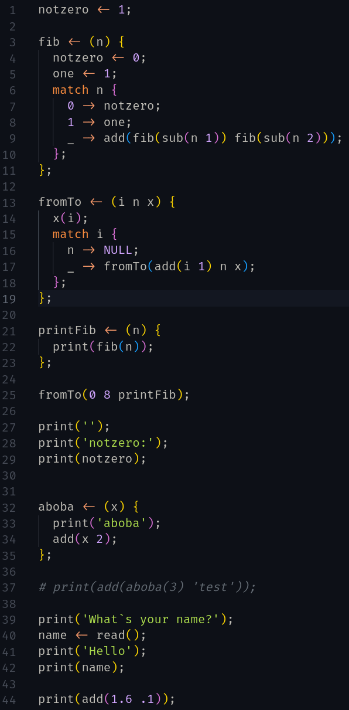
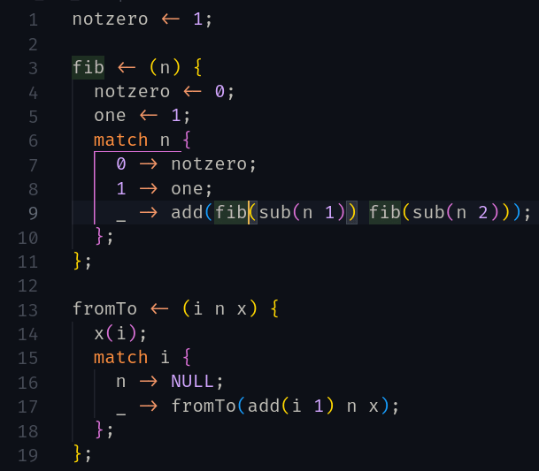

# fluent-vsc

fluent (the programming language) support for vscode.

## Features

Currently there are not many features:

### Syntax highlighting (more like lexical highlighting)

### General QoL

You can comment your code, enclose it in brackets, quotes, parens, braces.

## Requirements

Currently there are none, but in future
I want this extension to allow you to run code by pressing F5.
For this you will have to install
[fluent interpreter](https://github.com/dazzlemon/fluent) on your machine.

## Extension Settings

Currently there are none, but when interpreter will be a requirement,
you will have ability to specify its location.

## Known Issues

No semantic highliting.

## Release Notes

### 18.06.2022

Initial release, main feature is syntax higlighting.
